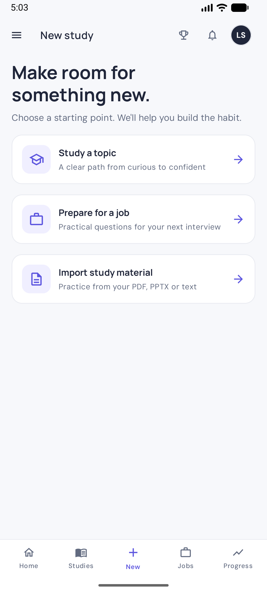
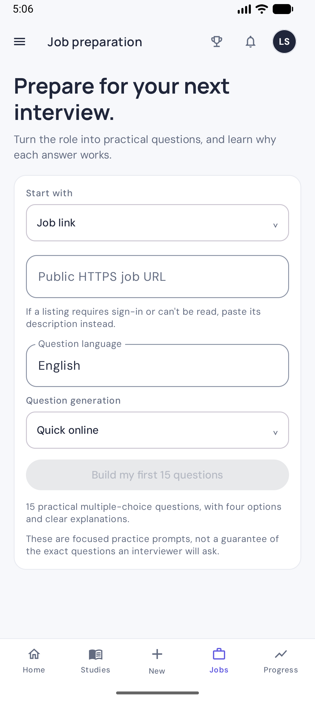
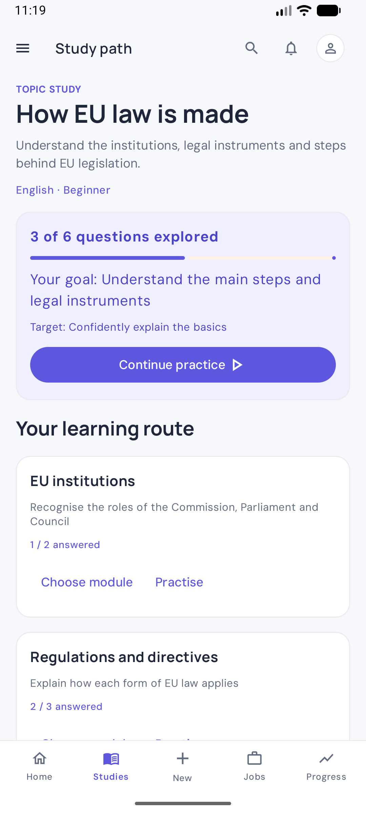
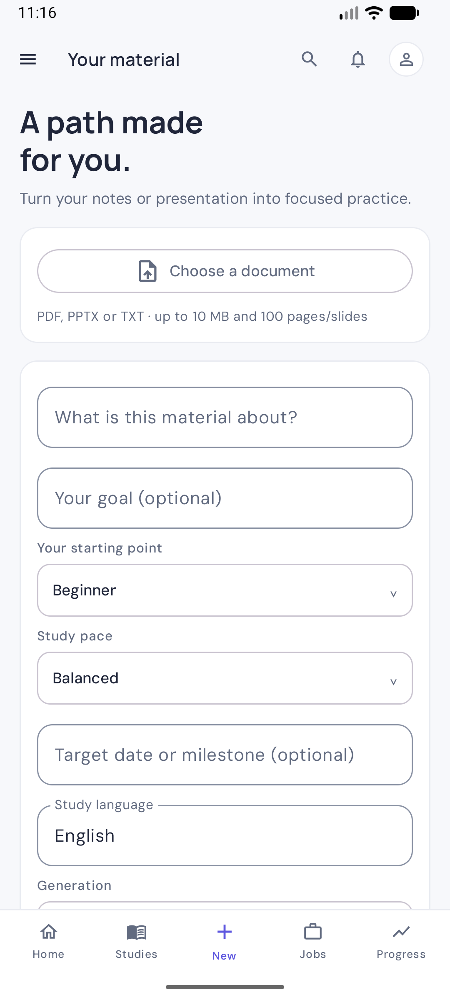
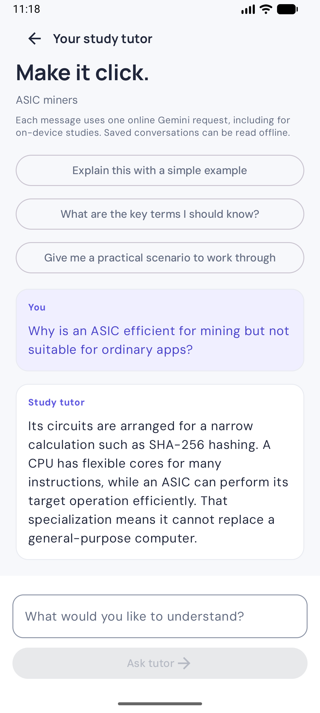
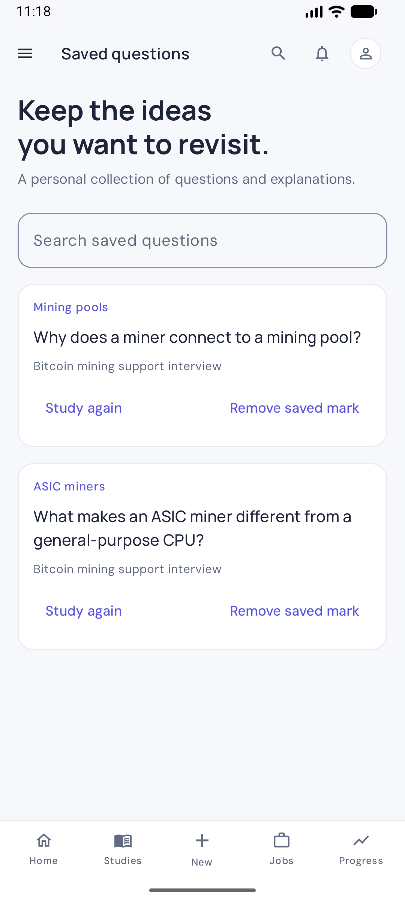
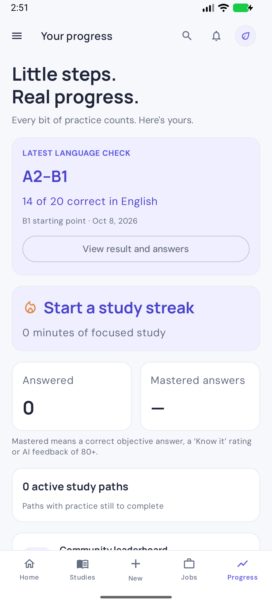
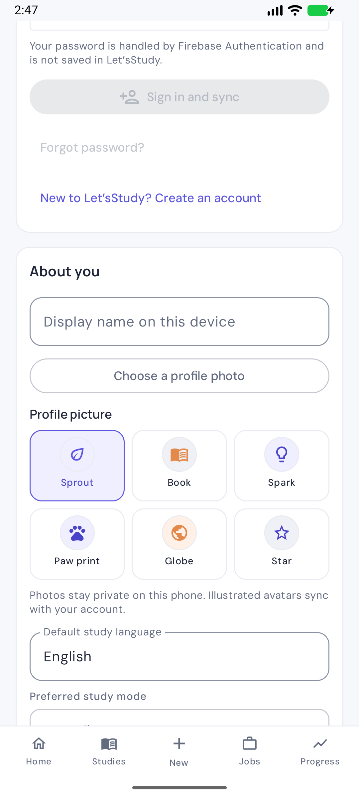
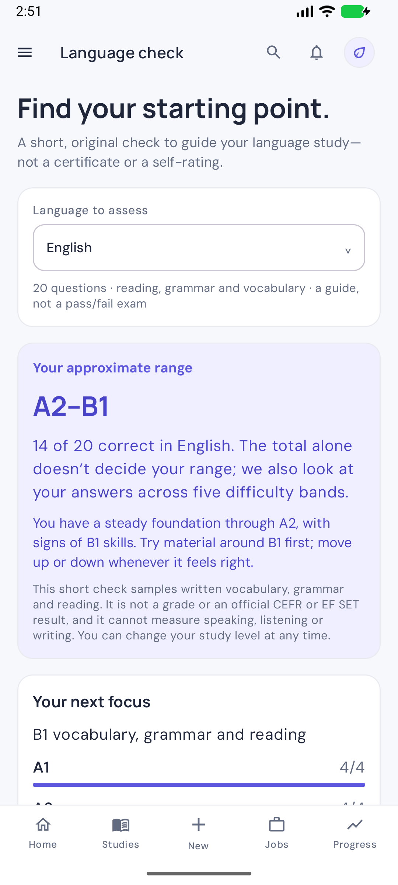

# Let’sStudy

<p align="center"></p>

> **Not feeling ready for your next interview? Let’sStudy turns a job description into focused practice, one question at a time.**

Let’sStudy is a native Android study app for preparing with purpose. It turns job descriptions into role-specific interview practice, and helps anyone build a study path around a subject, a language, or their own documents. Someone preparing for a technical interview can study likely questions; another learner can study European law from material they trust or practise English from a level that suits them. Each answer includes an explanation. Studies are saved on the phone and can optionally sync across devices with a Firebase account.

## A workspace built for learning

- **Interview preparation:** public job URLs or pasted descriptions, domain-specific questions, mock interview rounds, typed answers and optional Android dictation.
- **Learn beyond interviews:** build a path for any topic or language with a goal, starting level, pace, target date and ordered modules. An original 20-question check estimates a written-language range for English, Spanish, French or Thai, then pre-fills a tailored study path. The estimate considers the pattern across difficulty bands, not just the total correct; it offers a flexible starting point rather than a pass/fail label. Results and answer review are saved. The check is not a certified or official CEFR/EF SET score.
- **Bring study material:** import text PDFs, PPTX presentations or TXT files and preview their extracted text. Limits: 10 MB, 100 pages/slides and the first 18,000 characters. Scanned PDFs can use on-device OCR for up to 30 Latin-script pages; Thai-script scans are not supported yet.
- **Nine practice formats:** multiple choice, true/false, open answers, fill-in-the-blank, flashcards, scenarios, interview answers, code/commands and vocabulary. Code is studied as text and never executed.
- **Understand the answer:** immediate explanations, reference answers, saved deeper lessons and a contextual AI tutor. Objective answers and recall ratings are scored locally; written feedback is an explicit AI request.
- **Stay organised:** searchable studies/jobs, history, saved questions, confirmed deletion, topic strengths, active paths, streaks and actual foreground study time. Answered questions enter an offline spaced-review queue with longer intervals after successful recall.
- **Keep placement results:** completed language checks save the score, estimated range and selected answers. The latest result and earlier attempts are available from Progress; signed-in learners can sync them with their private study data.
- **Study together if you choose:** an optional weekly community board publishes only a chosen community username and a capped, self-reported score after separate consent. Names follow a restricted format and a basic inappropriate/reserved-name filter. Email, profile display name, study topics and answers stay private.
- **Sync when you choose:** study as a guest, or create an optional account to sync your private study library across Android devices.
- **Make it personal:** choose a display name, a unique username and one of six original illustrated avatars. Username rules block configured offensive terms and reserved names. Your avatar stays on this phone as a guest or syncs privately with your account; it is never used on the community board. Set a default study language and optional daily reminders or weekly summaries.

The interface is built for portrait Android use with native Compose controls, shared visual components and readable scrolling screens.

## The learner experience

1. **Start with a job listing or a subject.** Paste a public HTTPS URL or listing text, choose a question language, or build a path around a subject, language, or imported material. A learner can take the original language check to choose a starting point.
2. **Practise likely interview questions.** The first round has 15 multiple-choice questions, each with four plausible options, one marked answer, and a short explanation. Questions are shaped around the advertised duties and relevant industry context; unsupported company-specific details are identified as inferences.
3. **Learn as you go.** After choosing an answer, the app explains the idea and lets the learner move directly to the next question. The answer and review state are saved on the device and sync when the learner has opted in.
4. **Go deeper when needed.** “Learn this topic” requests an optional mini-lesson with a definition, how it works, a practical example, key terms, and a takeaway. The lesson is saved with its question and can be reopened offline. The first lesson request uses one additional shared Gemini request; reopening it does not.
5. **Keep practising.** Each “Add 15 questions” action asks for a fresh round based on the role and earlier questions; repeated questions are rejected. Sessions, choices, written-answer feedback, and saved questions remain available in the study library.
6. **Return at the right time.** Correct recall schedules a longer review interval; an incorrect or difficult answer returns sooner. Review scheduling is local, works offline, and does not call AI.
7. **Build language skills over time.** The original check estimates a starting level from written vocabulary, grammar and reading in English, Spanish, French or Thai. It saves the result and answer review, then shapes a language path with short theory lessons, examples and common mistakes. Fresh progress checks can move the active level up one step at a time; a lower single result never moves it down. Speaking, listening and writing are not measured, so the estimate is study guidance, not an exam credential.

## App preview

Screenshots show the current native Android interface with fictional study content captured in an isolated emulator. Sample sessions and learner data are not included in production builds.

| Home | Choose a study path | Job preparation | Interview learning path | Topic learning path |
| --- | --- | --- | --- | --- |
|  |  |  |  |  |

| Multiple-choice practice | Understand the concept | Study library | Import material |
| --- | --- | --- | --- |
|  |  |  |  |

| Study tutor | Saved questions | Learning progress | Optional profile and sync |
| --- | --- | --- | --- |
|  |  |  |  |

### Language placement check

The check uses two original question forms per language. Results and answer review are saved in Progress. Language paths include an explanation, example and common mistake for each module, and learners can take a fresh progress check from that path. The path advances one level at a time based on the check; each new level creates a new path while keeping earlier study sessions intact.

Learners can keep an illustrated profile avatar or choose a personal photo. Photos are resized and saved in the app's private storage on that phone; they are not uploaded or included in account sync. Illustrated avatars remain available for cross-device sync without enabling paid Firebase Storage.

The placement bank is authored for Let’sStudy; it does not reproduce edX, EF SET or other exam questions.



## AI modes and limits

**Fast online** uses Firebase AI Logic with Gemini 3.1 Flash-Lite. The app fetches a listing URL on the phone, then sends the extracted listing context to Google to generate each question round. A deeper lesson is a separate request, made only when the learner asks for one. This gives a quick path through the study material, but all online learners share the app owner’s Gemini project quota. Limits can change or be exhausted, and service response time is not guaranteed. Firebase App Check helps protect the project; it does not remove quota limits.

The project owner can review usage and model limits in [Google AI Studio](https://aistudio.google.com/rate-limit). Select the same Google Cloud project connected to Firebase and look for Gemini 3.1 Flash-Lite. RPM, TPM, and RPD are request-per-minute, token-per-minute, and request-per-day limits. Limits are not a promise of a fixed number of free questions. Saved answers and cached lessons do not make AI requests.

**On-device** is an optional alternative using Gemma 4 E2B through LiteRT-LM. It requires a one-time download of about 2.59 GB and can take several minutes to generate a round. After the model is downloaded, pasted job text can be studied without sending the listing to a generation service. Public URLs still need an internet connection to load. On-device mode is separate from the optional deeper lesson, which currently uses the online Gemini service on first generation.

Learners do not need a ChatGPT or Gemini account. A Let’sStudy account is optional and is used only to sync study data between devices. It does not increase the app’s shared Gemini quota. The app owner supplies Firebase configuration for their own build and is responsible for monitoring that quota.

## Privacy and accuracy

- Job URLs are fetched by the Android app. Pages that require sign-in or block automated access must be pasted into the app by the learner.
- Fast online sends relevant material and request context to Google through Firebase AI Logic. Written feedback includes the submitted answer; tutor requests include bounded history and study context. A one-time in-app disclosure explains online processing.
- Sessions, answers, bookmarks, lessons, tutor messages and progress are saved locally in Room. Android backup is disabled. Cached content can be read offline; uninstalling removes local study data.
- Account sync is optional. After the learner accepts the in-app disclosure, the app stores the private profile and copies study material and source context, questions, answers, saved lessons, tutor conversations and progress to Firestore under that learner’s Firebase user ID. Firebase Authentication manages account credentials; Let’sStudy does not store passwords. Sign-out syncs and clears the account’s study cache from that phone. Account deletion removes the profile, username reservation, cloud records and Firebase account.
- Learner profiles and study records are private and owner-only. Authenticated users can check whether one exact username is reserved; the reservation stores no account ID, and collection listing is denied. Usernames are not publicly displayed unless a learner opts into the separate community board. That board shows a filtered community username and weekly points; entries contain no UID, email, profile display name, or study content. The name filter is a practical first layer, not a guarantee against every offensive variant.
- Community-board points are calculated on the device from answered questions and tracked study time, capped at 500 per week, and uploaded only when a participant opens or refreshes the board. They are not verified or cheat-resistant. Leaving the board removes its public entry.
- The project owner must publish the current [`firestore.rules`](firestore.rules) before profile creation, cloud sync or the community board can work. Create the composite index described in [`firestore.indexes.json`](firestore.indexes.json) for `publicLeaderboard` (`weekKey` ascending, then `weeklyPoints` descending). This repository update does not publish rules or indexes to Firebase Console. Do not enable unrestricted public read/write rules.
- Scanned-PDF OCR runs on the phone using bundled Latin-script recognition. The app does not upload the original document for OCR; Google ML Kit may separately contact Google for service updates and send SDK performance/usage metrics. If the learner later requests AI-generated study questions from imported text, that separate action follows the selected online/on-device generation mode.
- On-device generation keeps listing text and prompts on the phone. The model file is downloaded from Hugging Face to app-private storage.
- AI-generated material can be incomplete or incorrect. Learners should verify technical commands, safety guidance, and company-specific claims before relying on them.
- Topic paths use model knowledge and imported text; they do not perform live legal or factual verification.

### Request budget

A topic/document plan makes one request. An online round makes one for 15 questions; a mock interview makes one for five. On-device rounds use batches of up to five. Written feedback, the first deeper lesson and each tutor message are separate requests. Tutor and first deeper lessons use online Gemini even for on-device paths. Saved content, objective scoring, flashcard ratings, progress and reminders make no AI requests. New workspace actions do not automatically retry failures.

## Technology

- Kotlin and Jetpack Compose for the Android app and interface.
- Room for local sessions, answers, question review, and cached concept lessons.
- Two locally authored 20-question language-check forms in English, Spanish, French and Thai, saved progress history, stepwise level advancement, and Room-backed spaced review.
- Firebase Authentication for optional email accounts and Cloud Firestore for UID-scoped study synchronization.
- An opt-in Firestore community board that exposes only a selected nickname and weekly points.
- Bundled Google ML Kit Text Recognition for on-device Latin-script OCR of scanned PDF pages.
- Firebase AI Logic and Gemini 3.1 Flash-Lite for fast online question and lesson generation.
- LiteRT-LM and Gemma 4 E2B for optional on-device question generation.
- WorkManager and resumable, checksum-verified model download support.
- Google ML Kit Text Recognition v2 for bundled, on-device OCR of Latin-script scanned PDFs; this increases app size and does not recognize Thai script.
- Jsoup and a bounded HTTPS reader for public job pages.
- PDFBox Android for text PDF extraction and bounded XML parsing for PPTX.
- DM Sans and Manrope under the SIL Open Font License.

The main app lives in `android/`. Architecture notes are in [`docs/architecture.md`](docs/architecture.md), product/design notes in [`docs/design-notes.md`](docs/design-notes.md), and model attribution in [`THIRD_PARTY_NOTICES.md`](THIRD_PARTY_NOTICES.md).

## Build and Firebase configuration

### Requirements

- Android Studio with Android SDK 36 and a Java 17 runtime.
- A Firebase project with an Android app registered as `com.oriol.letsstudy`.

### Configure a local build

1. Enable **Firebase AI Logic** for the Firebase project and configure the **Gemini Developer API**.
2. In Firebase project settings, register the Android app with package name `com.oriol.letsstudy` and download its `google-services.json`.
3. Place that file at `android/app/google-services.json`. It is intentionally ignored by Git; each developer supplies their own Firebase configuration.
4. In **Authentication → Sign-in method**, enable **Email/Password**. It is enabled in the original `letsstudy-3fc1d` project. Learners can still study without creating an account.
5. Create a **Cloud Firestore** database in production mode. The original `letsstudy-3fc1d` project uses `asia-southeast3` (Bangkok); Firestore's database location cannot be changed after creation. For another project, select the region where most early learners are located. Keep the project on Firebase’s Spark plan unless the maintainer chooses to add billing.
6. Publish the current access policy from [`firestore.rules`](firestore.rules) in **Firestore Database → Rules**. It keeps profiles and study records private to their owner and adds the explicitly opted-in board projection. The original `letsstudy-3fc1d` project needs this version before the updated account/board flows work; updating this repository does not change Firebase Console rules.
7. Create the composite index listed in [`firestore.indexes.json`](firestore.indexes.json) in **Firestore Database → Indexes**. It orders the current week's board by points. Firebase may also display a link to create this index after the first board query.
8. Configure Firebase App Check. For a local debug build, use the debug provider and register the token printed in Logcat under **Firebase Console → App Check → Apps → Manage debug tokens**. Keep the token private and out of source control. For a distributed release, configure Play Integrity and the release signing certificate.

Firestore sync uses the project’s free usage allowance when available. It is finite, shared by the Firebase project and separate from Gemini’s request quota. Check the [Firebase pricing page](https://firebase.google.com/pricing) before inviting many users; the app does not enable billing or upgrade the project.

Build a debug APK from the Android project directory:

```powershell
cd android
./gradlew.bat :app:assembleDebug
```

The APK is written to `android/app/build/outputs/apk/debug/app-debug.apk`. A successful build checks compilation; Firebase configuration, App Check, online generation, and device-specific on-device inference require separate validation.

Run `./gradlew.bat :app:testDebugUnitTest :app:lintDebug :app:assembleRelease` for checks and the distribution build. The release APK is unsigned until the maintainer supplies private signing configuration. Debug builds require device-specific App Check registration and are intended for development.

## License

The repository includes notices for third-party model and runtime components. Let’sStudy itself does not currently declare an open-source license.
