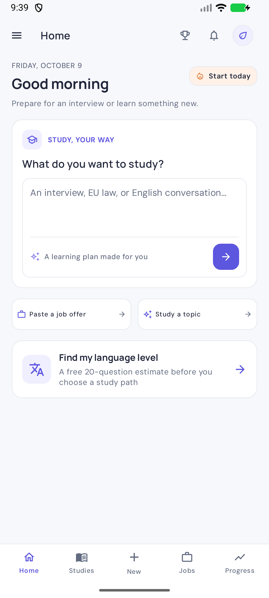
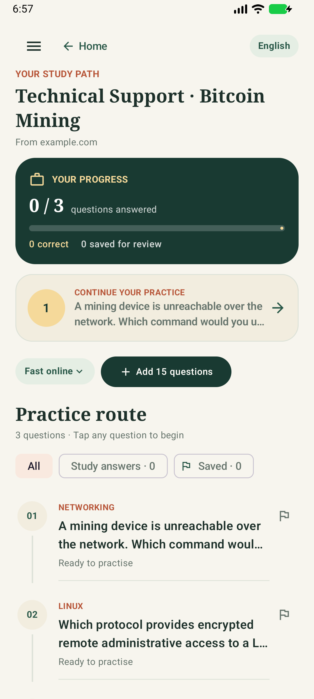
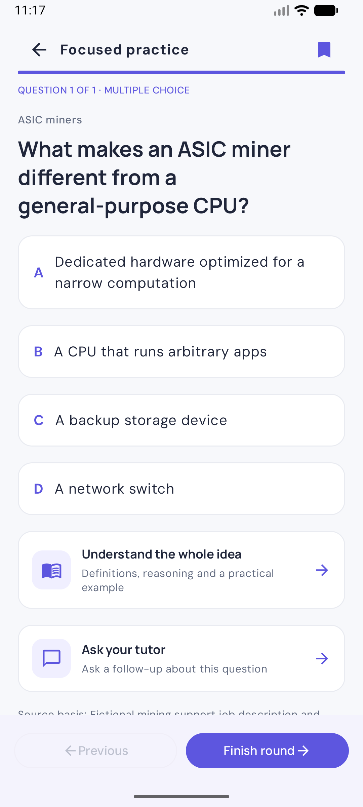
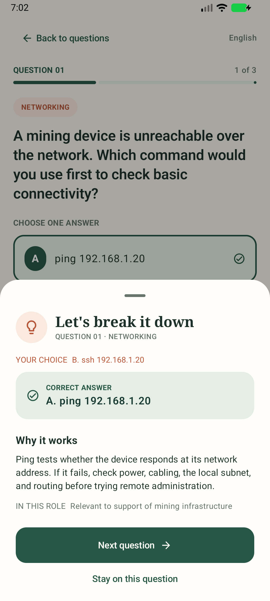
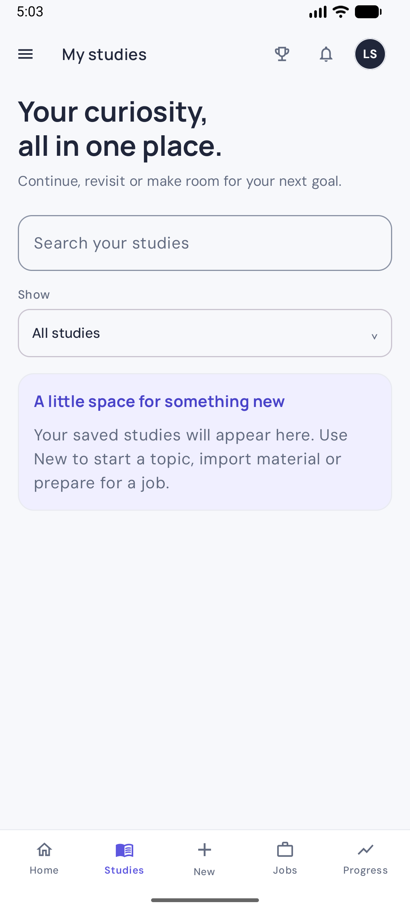

# Let’sStudy

<p align="center"></p>

> **Not feeling ready for your next interview? Let’sStudy turns a job description into focused practice, one question at a time.**

Let’sStudy is a native Android study app for people preparing for a specific job interview. It turns a public job listing or pasted job description into practical, four-option questions about the role and its domain. Learners can work through one question at a time, understand why an answer is right, review their progress later, and ask for a deeper lesson when a concept is unfamiliar.

## The learner experience

1. **Start with a job listing.** Paste a public HTTPS URL or the listing text, then choose English, Spanish, Thai, or another question language.
2. **Practise likely interview questions.** The first round has 15 multiple-choice questions, each with four plausible options, one marked answer, and a short explanation. Questions are shaped around the advertised duties and relevant industry context; unsupported company-specific details are identified as inferences.
3. **Learn as you go.** After choosing an answer, the app explains the idea and lets the learner move directly to the next question. The answer and review state are saved on the device.
4. **Go deeper when needed.** “Learn this topic” requests an optional mini-lesson with a definition, how it works, a practical example, key terms, and a takeaway. The lesson is saved with its question and can be reopened offline. The first lesson request uses one additional shared Gemini request; reopening it does not.
5. **Keep practising.** Each “Add 15 questions” action asks for a fresh round based on the role and earlier questions; repeated questions are rejected. Sessions, choices, written-answer feedback, and saved questions remain available in the study library.

## App preview

The debug preview uses a sample Bitcoin-mining support role. Its sample content is local and does not consume Gemini quota.

| Home | Study path | Multiple choice | Answer explanation | Session library |
| --- | --- | --- | --- | --- |
|  |  |  |  |  |

## AI modes and limits

**Fast online** uses Firebase AI Logic with Gemini 3.1 Flash-Lite. The app fetches a listing URL on the phone, then sends the extracted listing context to Google to generate each question round. A deeper lesson is a separate request, made only when the learner asks for one. This gives a quick path through the study material, but all online learners share the app owner’s Gemini project quota. Limits can change or be exhausted, and service response time is not guaranteed. Firebase App Check helps protect the project; it does not remove quota limits.

The project owner can review usage and model limits in [Google AI Studio](https://aistudio.google.com/rate-limit). Select the same Google Cloud project connected to Firebase and look for Gemini 3.1 Flash-Lite. RPM, TPM, and RPD are request-per-minute, token-per-minute, and request-per-day limits. Limits are not a promise of a fixed number of free questions. Saved answers and cached lessons do not make AI requests.

**On-device** is an optional alternative using Gemma 4 E2B through LiteRT-LM. It requires a one-time download of about 2.59 GB and can take several minutes to generate a round. After the model is downloaded, pasted job text can be studied without sending the listing to a generation service. Public URLs still need an internet connection to load. On-device mode is separate from the optional deeper lesson, which currently uses the online Gemini service on first generation.

Learners do not need a ChatGPT or Gemini account. The app owner supplies Firebase configuration for their own build and is responsible for monitoring the shared Gemini quota.

## Privacy and accuracy

- Job URLs are fetched by the Android app. Pages that require sign-in or block automated access must be pasted into the app by the learner.
- Fast online sends extracted job text and question-generation context to Firebase AI Logic. When the learner asks for a concept lesson, that request also includes the relevant question, answer choices, correct answer, explanation, and role context. The learner’s own answers and saved progress are not sent for question generation or concept lessons.
- Sessions, selected choices, saved questions, and generated lessons are stored locally in Room. Cached lessons can be read offline.
- On-device generation keeps listing text and prompts on the phone. The model file is downloaded from Hugging Face to app-private storage.
- AI-generated material can be incomplete or incorrect. Learners should verify technical commands, safety guidance, and company-specific claims before relying on them.
- Let’sStudy currently focuses on interview preparation from job listings or pasted descriptions. General-topic study and presentation/PDF import are not implemented.

## Technology

- Kotlin and Jetpack Compose for the Android app and interface.
- Room for local sessions, answers, question review, and cached concept lessons.
- Firebase AI Logic and Gemini 3.1 Flash-Lite for fast online question and lesson generation.
- LiteRT-LM and Gemma 4 E2B for optional on-device question generation.
- WorkManager and resumable, checksum-verified model download support.
- Jsoup and a bounded HTTPS reader for public job pages.

The main app lives in `android/`. Architecture notes are in [`docs/architecture.md`](docs/architecture.md), product/design notes in [`docs/design-notes.md`](docs/design-notes.md), and model attribution in [`THIRD_PARTY_NOTICES.md`](THIRD_PARTY_NOTICES.md).

## Build and Firebase configuration

### Requirements

- Android Studio with Android SDK 36 and a Java 17 runtime.
- A Firebase project with an Android app registered as `com.oriol.letsstudy`.

### Configure a local build

1. Enable **Firebase AI Logic** for the Firebase project and configure the **Gemini Developer API**.
2. In Firebase project settings, register the Android app with package name `com.oriol.letsstudy` and download its `google-services.json`.
3. Place that file at `android/app/google-services.json`. It is intentionally ignored by Git; each developer supplies their own Firebase configuration.
4. Configure Firebase App Check. For a local debug build, use the debug provider and register the token printed in Logcat under **Firebase Console → App Check → Apps → Manage debug tokens**. Keep the token private and out of source control. For a distributed release, configure Play Integrity and the release signing certificate.

Build a debug APK from the Android project directory:

```powershell
cd android
./gradlew.bat :app:assembleDebug
```

The APK is written to `android/app/build/outputs/apk/debug/app-debug.apk`. A successful build checks compilation; Firebase configuration, App Check, online generation, and device-specific on-device inference require separate validation.

## License

The repository includes notices for third-party model and runtime components. Let’sStudy itself does not currently declare an open-source license.
